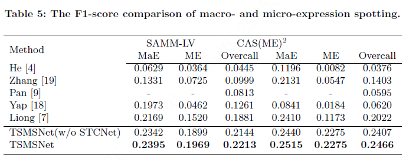

## A Two-stage Deep Neural Network for Macro- and Micro-Expression Spotting from Long-term Videos

### Introduction

We presented an efficient expression spotting framework (TSMSNet) towards the challenge of MaE and ME spotting in MEGC 2021, https://megc2021.github.io. The MEGC 2021 is one challenge of Multimedia Grand Challenges in ACM MultiMedia (ACM MM) 2021, https://2021.acmmm.org.

### Steps

#### images-process


* landmarks through the method  [Supervision-by-Registration: An Unsupervised Approach to Improve the Precision of Facial Landmark Detectors](https://github.com/facebookresearch/supervision-by-registration)
* extract the optical flow features with frame skip/ shorter frame skip

* remove global head motion, eye masking, ROI selection

#### apex-frame spotting

* apex-frame spotting through frame skip and the apex-frame spotting network

#### macro- and micro-expression spotting

* macro- and micro-expression spotting through shorter frame skip and the network
* merge predicted  intervals for improve the performance 

### Training

In the experiment, Pytorch is used and the two datasets can be achieved by applying

CAS(ME)<sup>2</sup> - http://fu.psych.ac.cn/CASME/cas(me)2-en.php

SAMM Long Videos - http://www2.docm.mmu.ac.uk/STAFF/M.Yap/dataset.php

### Results



### Reproduce the results

* All the folders are placed as follows and the pre-trained weights are  located under weights/weights_merge.
  ```python
  ├── README.md
  ├── calculate.py
  ├── data
  │   ├── data.py
  │   └── data_merge.py
  ├── images
  │   ├── CAS_ME2_longVideoFaceCropped
  │   └── SAMM
  ├── img
  │   ├── net.png
  │   ├── net_merge.png
  │   ├── preprocess.png
  │   └── result.png
  ├── input
  │   ├── CAS.xlsx
  │   └── SAMM.xlsx
  ├── model
  │   ├── model.py
  │   └── model_merge.py
  ├── output
  │   ├── preprocess_npy
  │   │   ├── cas_macro
  │   │   ├── cas_macro_merge_input
  │   │   ├── cas_micro
  │   │   ├── cas_micro_merge_input
  │   │   ├── samm_macro
  │   │   ├── samm_macro_merge_input
  │   │   ├── samm_micro
  │   │   └── samm_micro_merge_input
  │   ├── step1
  │   │   ├── result_npy
  │   │   └── samm-macro.txt
  │   ├── step2
  │   │   ├── SAMM_ME_pred_inter_merge.txt.txt
  │   │   └── result_npy
  │   └── step3
  │       ├── LOG_CAS_Macro.txt
  │       ├── LOG_CAS_Micro.txt
  │       ├── LOG_SAMM_Macro.txt
  │       └── LOG_SAMM_Micro.txt
  ├── preprocess
  │   ├── process.py
  │   └── process_merge.py
  ├── step1_apex_spotting.py
  ├── step2_expression_interval.py
  ├── step3_save_result.py
  ├── train.py
  ├── train_merge.py
  ├── utils
  │   └── utils.py
  └── weights
      ├── 1st
      │   ├── cas-macro
      │   ├── cas-micro
      │   ├── samm-macro
      │   └── samm-micro
      └── 2nd
          ├── cas-macro
          ├── cas-micro
          ├── samm-macro
          └── samm-micro 
  ```
* Installation of packages using pip

  ```python
  pip install -r requirements.txt
  ```

* The result of face detection and facial landmark detection 
  ```python
  ├── json
  │   ├── cas_json
  │   └── samm_json
  ```
* Preprocess dataset

  ```python
  # --start --end: choose the subject for processing
  # --K: the parameter which control the length of frmae skip when preprocess
  #  CAS-MAE:12,CAS-ME:31, SAMM-MAE:42, SAMM-ME:227
  python3 ./process/process.py --start 0 --end 8 --K 42
  python3 ./process/process_merge.py --start 0 --end 8 --K 42
  ```
  ```python
  └── preprocess
      ├── cas_macro
      ├── cas_macro_merge
      ├── cas_micro
      ├── cas_micro_merge
      ├── samm_macro
      ├── samm_macro_merge
      ├── samm_micro
      └── samm_micro_merge
  ```
  The result of face detection, facial landmark detection and  preprocess can be achieved by [here](https://pan.baidu.com/s/1EUKWjfvPLf_JDnK36a68Hw). The extract password is 6p2e.

* Training and evaluation

  ```python
  # Training
  python3 train.py --start 0 --end 30 --P 0.5 --K 42 --path_xlsx ./input/SAMM.xlsx --
  mode Micro
  # --start --end: choose the subject for traning
  # --P: the tuning parameter which is used to set the threshold for finding peak frame 
  #      CAS:0.55, SAMM:0.5
  # --K: the parameter which control the length of frame skip when training
  #      CAS-MaE:12,CAS-ME:31 SAMM-MaE:42, SAMM-ME:227
  # --path_data: the path of data after preprocessing
  # --path_xlsx: the xlsx file of dataset, SAMM.xlsx/CAS.xlsx
  # --mode: expression type: Micro/Macro
  
  
  # evaluation
  # setp1: apex frame spotting
  python3 step1_apex_spotting.py --dataset SAMM --start 0 --end 30 --P 0.5 --K 42 --pre_data_path ./output/process_npy/samm_micro/ --xlsx_path ./input/SAMM.xlsx --base_weight_path ./weights/1st/samm-micro --mode Micro --save_path ./output/step1/result_npy
  python3 step1_apex_spotting.py --dataset SAMM --start 0 --end 30 --P 0.5 --K 227 --pre_data_path ./output/process_npy/samm_macro/ --xlsx_path ./input/SAMM.xlsx --base_weight_path ./weights/1st/samm-macro --mode Macro --save_path ./output/step1/result_npy
  python3 step1_apex_spotting.py --dataset CAS --start 0 --end 30 --P 0.55 --K 12 --pre_data_path ./output/process_npy/cas_micro/ --xlsx_path ./input/CAS.xlsx --base_weight_path ./weights/1st/cas-micro --mode Micro --save_path ./output/step1/result_npy
  python3 step1_apex_spotting.py --dataset CAS --start 0 --end 30 --P 0.55 --K 31 --pre_data_path ./output/process_npy/cas_macro/ --xlsx_path ./input/CAS.xlsx --base_weight_path ./weights/1st/cas-macro --mode Macro --save_path ./output/step1/result_npy
  
  # The results are placed in the folder './output/step1', e.g. ./output/step1/result_npy/pred_inter_SAMM_Micro_42.npy
  # --dataset:the dataset name, the option is SAMM or CAS
  # --start --end: choose the subject for testing
  # --P: the tuning parameter which is used to set the threshold for finding peak frame 
  #      CAS:0.55, SAMM:0.5
  # --K: the parameter which control the length of frame skip
  #      CAS-MaE:12,CAS-ME:31 SAMM-MaE:42, SAMM-ME:227
  # --mode: expression type: Micro/Macro
  # --xlsx_path: the xlsx file of dataset, SAMM.xlsx/CAS.xlsx
  # --pre_data_path: the path of saved preprocessing data
  # --base_weight_path: the path of weights which are corresponding to the TSANet for apex frame spotting 
  
  
  # setp2: expressin interval proposals
  python3 step2_expression_interval.py --dataset SAMM --start 0 --end 30 --P 0.5 --K 42 --L 21 --pre_data_path ./output/process_npy/samm_micro_merge --xlsx_path ./input/SAMM.xlsx --base_weight_path ./weights/2nd/samm-micro --step1_npy_path ./output/step1/result_npy/pred_inter_SAMM_Micro_42.npy --mode Micro --save_path ./output/step2/result_npy
  python3 step2_expression_interval.py --dataset SAMM --start 0 --end 30 --P 0.5 --K 227 --L 114 --pre_data_path ./output/process_npy/samm_macro_merge --xlsx_path ./input/SAMM.xlsx --base_weight_path ./weights/2nd/samm-macro --step1_npy_path ./output/step1/result_npy/pred_inter_SAMM_Macro_227.npy --mode Macro --save_path ./output/step2/result_npy
  python3 step2_expression_interval.py --dataset CAS --start 0 --end 30 --P 0.55 --K 12 --L 6 --pre_data_path ./output/process_npy/cas_micro_merge --xlsx_path ./input/CAS.xlsx --base_weight_path ./weights/2nd/cas-micro --step1_npy_path ./output/step1/result_npy/pred_inter_CAS_Micro_12.npy --mode Micro --save_path ./output/step2/result_npy
  python3 step2_expression_interval.py --dataset CAS --start 0 --end 30 --P 0.55 --K 31 --L 16 --pre_data_path ./output/process_npy/cas_macro_merge --xlsx_path ./input/CAS.xlsx --base_weight_path ./weights/2nd/cas-macro --step1_npy_path ./output/step1/result_npy/pred_inter_CAS_Macro_31.npy --mode Macro --save_path ./output/step2/result_npy
  
  # The results are placed in the folder './output/step2', e.g. ./output/step2/result_npy/pred_inter_merge_SAMM_Micro_42.npy 
  # --dataset:the dataset name, the option is SAMM or CAS
  # --start --end: choose the subject for testing
  # --P: the tuning parameter which is used to set the threshold for finding peak frame 
  #      CAS:0.55, SAMM:0.5
  # --K: the parameter to control the length of frame skip
  #      CAS-MaE:12,CAS-ME:31 SAMM-MaE:42, SAMM-ME:227
  # --L: the parameter to control the number of several short clips
  #      CAS-MaE:6,CAS-ME:16 SAMM-MaE:21, SAMM-ME:114
  # --mode: expression type: Micro/Macro
  # --xlsx_path: the xlsx file of dataset, SAMM.xlsx/CAS.xlsx
  # --pre_data_path: the path of saved preprocessing data
  # --step1_npy_path: the path of saved the result of step1, which is the apex frame spotting result
  # --base_weight_path: the path of weights which are corresponding to the STCNet for expression interval proposals 
  
  
  # step3: write the results to txt
  python3 step3_save_result.py --path_npy ./output/step2/result_npy/pred_inter_merge_SAMM_Micro_42.npy --path_xlsx ./input/SAMM.xlsx --dataset SAMM --mode Micro
  python3 step3_save_result.py --path_npy ./output/step2/result_npy/pred_inter_merge_SAMM_Macro_227.npy --path_xlsx ./input/SAMM.xlsx --dataset SAMM --mode Macro
  python3 step3_save_result.py --path_npy ./output/step2/result_npy/pred_inter_merge_CAS_Micro_12.npy --path_xlsx ./input/CAS.xlsx --dataset CAS --mode Micro
  python3 step3_save_result.py --path_npy ./output/step2/result_npy/pred_inter_merge_CAS_Macro_31.npy --path_xlsx ./input/CAS.xlsx --dataset CAS --mode Macro
  # The result is like in SAMM_ME_pred_inter_merge.txt
  # --path_npy：the path of saved the result of step2, which is the expression spotting result
  # --dataset:the dataset name, the option is SAMM or CAS
  # --mode: expression type: Micro/Macro
  ```
  
  **All the final results are placed in the folder './output/step3' as follows:**
  ```python
  ├── LOG_CAS_Macro.txt
  ├── LOG_CAS_Micro.txt
  ├── LOG_SAMM_Macro.txt
  └── LOG_SAMM_Micro.txt 
  ```
### Contact

##### Please email us at hundan135846@163.com if you have any inquiries or issues.
